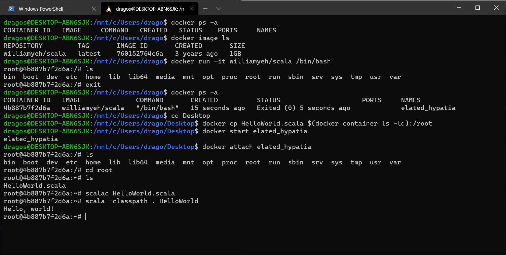
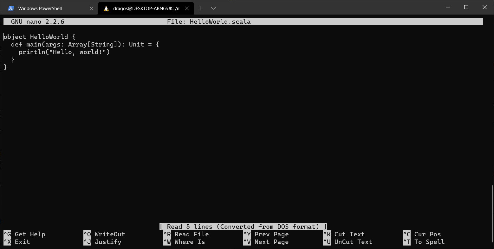

# Assignment 1
---

# Table of contents:
  * [Introduction](#introduction)
  * [Motivation](#the-truth-of-the-matter)
  * [The serious part](#getting-real)
  * [Conclusion](#ending-on-a-high-note)

### Introduction
---

Hello to you dear reader and welcome to a brief introduction about _myself_.

I am your regular ol' Computing Science student, name's Andrei Spiridon (s1027022; _hope these don't work as social security numbers_). As any other 21 year old terrified of what the future holds amid a full-blown pandemic crisis, I tend to drown my worries in endless [Youtube videos](https://www.youtube.com/watch?v=dQw4w9WgXcQ), video games and the likes.

### The truth of the matter
---

Now some of you may ask yourselves

> What existential dread could possibly push someone to potentially Rick Roll their colleagues and teacher?

Well my friends, this is what you call the old **on-vacation-with-your-girlfriend-and-her-parents** situation, where you just sit in the living room and work on your assignments so that god forbid her father starts another conversation about yesterday's game, and you don't even know what sport he's talking about!
 
### Getting real
---

Now, as any real _cOmPuTeR sCiEnTiSt_, I have spent the last couple of hours being spoonfed bash commands by other -smarter- computer scientists, to get my new project up and running. So this is the point where I share some of my experiences with the process.

First and foremost, here is a list of my computer's specs:
  * Model: HP 15-cx0007nq
  * CPU: Intel i7-8750H, 6 cores
  * GPU: NVidia GeForce GTX 1050 Ti
  * RAM: 8 GB
  * OS: Windows 10 Education

Overall, setting up WSL2 and Docker was very easy by following the provided youtube tutorial. It took enabling some windows features, making sure that all future Linux installations we configured as WSL2, then downloading and installing Docker and making sure that integration with all of my WSL2 distros was enabled.

Now, Scala was another story. I myself would consider that I am at least pretty able at least to understand Java, if not write in it. And "writing it"(let's be honest, we all copied the program from that first link) was easy indeed, but the usage of the text editors which have no auto formatting, suggestions, syntax analysis and the likes show how much of a monkey brained, color excited shell of a person today's text editors have made me. Nevertheless, i have gotten over my disgust and ran the program succesfully. Here are some screenshots of me using Docker and the provided Scala container:

### Ending on a high-note
---

Well, this has been fun, but I have to get to other assignments with deadlines during the next 2 days. I'll leave you with my favorite movie quote:

>“Do not go gentle into that good night,
>
>Old age should burn and rave at close of day;
>
>Rage, rage against the dying of the light.
>
>Though wise men at their end know dark is right,
>
>Because their words had forked no lightning they
>
>Do not go gentle into that good night.
>
>Rage, rage against the dying of the light.”
>
>                        - Professor Brand, Interstellar(2014)
