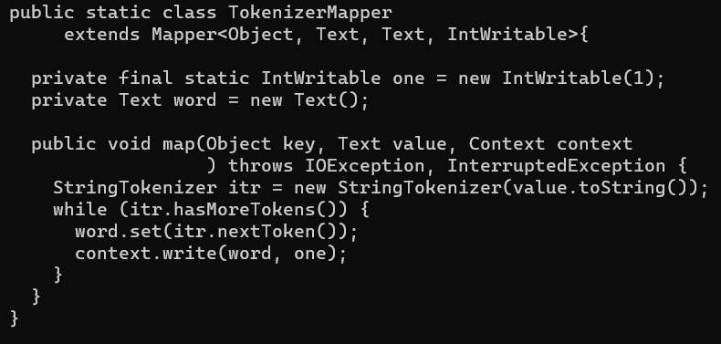
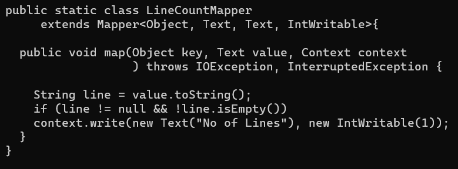

# Assignment 2
---

# Table of contents:
  * [Introduction](#introduction)
  * [Working with Hadoop](#my-experience-with-hadoop)
  * [Conclusion](#conclusions)

### Introduction
---
Welcome back dear reader to the second installment of "Why am I doing this to myself". This time around I am happily writing from before the official deadline (1h 30m before, but it's still something). Now, since time is not on my side here I will hurry this up and tell you the story of _"Why Hadoop and my machine are conspiring to make me fail this course"_.

 
### My experience with Hadoop
---
My overall experience with HDFS (Haddop Distributed File System) has been rocky at best. The setup that I did according to the Tutorial went smoothlyuntil I had to close everything down and return to it later. 

From there on, it happened on multiple occasions that the map reduce jobs I would try to run (mostly example code given in the tutorial) would be stuck at "map 0% reduce 0%" and the only solution I could find was to forcibly shut everything down and start over. Sometimes I even had to delete the Docker image and completely start over since something would break due to the forced shut down.

I did finally get everything working through some miracle and managed to run the WordCount job and my own LineCount job eventually. By using the "cat -n" command on the 100.txt input I found that the input text had 147838 lines. The result I got from my LineCount program was 130725 lines. The discrepancy is due to not counting the empty lines, making me believe (I did not count them myself, hence the slightly unsure formulation) that my program did indeed return the correct result by some standards.

The main difference in my program and the WordCount example is in the Mapper class, as it is probably obvious. This can be seen in the following image:

__Test code:__

__My code:__

### Conclusions
---

I am aware that I may have not done as much as was expected of me for this assignment. I had a very hard time understanding a lot of ideas that were mentioned in the Assignment, but I do believe that I did what I was required to do for this Assignment and I did understand how HDFS works.