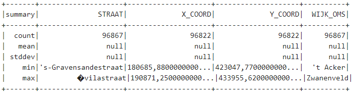
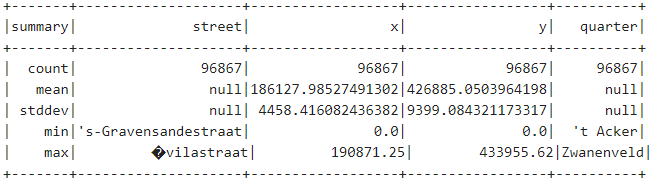

# Assignment 4
---

# Table of contents:
  * [Introduction](#introduction)
  * [Part A](#part-a)
  * [Part B](#part-b)
  * [Conclusion](#conclusion)


### Introduction
---
I will start by saying that while I think it is very cool how the city of Nijmegen (and probably other cities in the Netherlands as well) provides all this data for free, I would have enjoyed a dataset written out in English more, but I might be in the minority here.

This week we were given two data sets to work with:
  + A dataset called BAG, which contains data regarding the houses and streets of Nijmegen;
  + A dataset abbreviated as "kos", which contains data about artworks located in Nijmegen with their exact coordinates, year of creation, url and more.

There is not much more to introduce, as the working medium is exactly the same as last week, so I will jump right into discussing each notebook separately.

### Part A
---
#### Dealing with null values

A very useful tool one can use to see the distribution of their data while working with Spark is the function ```.describe().show()```. This gives you a table much like this one (keep in mind that this is made on the BAG dataset):



Surely, one of the most noticeable characteristics of the table are the null values populating the "mean" and "stddev"(standard deviation) fields of all the attributes. When talking about "STRAAT" or "WIJK_OMS", those represent string attributes, words which do not have a mean or standard deviation. But in the case of "X_COORD" and "Y_COORD", they are numbers; this means that the null values is being caused by -everyone, say it with me now!- INCOMPLETE DATASETS, HOORAY!

All joking aside, when trying to check for null coordinate values, 
```s
addrDF.filter( $"X_COORD".isNull && $"Y_COORD".isNull).count
addrDF.filter( $"X_COORD".isNull || $"Y_COORD".isNull).count

Output: 
res62: Long = 45
```
We get that there are 45 records in this dataset that have null values instead of coordinates. I used ```addrDF.filter( $"X_COORD".isNull ).show(45,false)``` in order to see all of these problematic records. The next step to take is choosing how to deal with these records. In some cases, it is fine to just ignore them especially when, as in this case, they represent only a very small part of the dataset (45/~10000 in this case); some other times, one should put in more effort and try to infer correct values by looking at the records with real values, but this is highly dependent on how the data you are working with is built and whether it can be inferred.

Something important to note is that different countries use different ways of writing their numbers, and I'm talking specifically about whether you us the comma for floating point numbers or for numbers bigger than 1000 (as in, writing 1,000 or 1.000 for one thousand). In our case, the Netherlands uses a comma for the floats specifically, so a function to convert those was needed.
```s
import java.text.NumberFormat
import java.util.Locale
val nf = NumberFormat.getInstance(Locale.forLanguageTag("nl")); // Handle floats written as 0,05 instead of 0.05

def convToFloat(s: String): Option[Float] = {
  try {
    Some(nf.parse(s).floatValue)
  } catch {
    case e: Exception => None
  }
}
```
Now, all of our values were finally in order, as we have also replaced null values with 0 with ```convToFloat(x).getOrElse(0f)``` and finally got this table:



Now, I will be honest and say that I had no idea how to read the output of the ```.explain()``` operator. This is something that I need to try and understand a lot more.

For the final part of this first notebook, we explored ways of figuring out what is wrong with a dataset only by looking at the statistics.

### Part B
---


### Conclusion
---
As last week, this was a rather pleasant experience and while I cannot say that I have an in-depth understanding of all that was discussed in the notebooks(such as the query explanation in part A), I believe I have understood most concepts to a level at which I can use them myself and succeed while doing so.

