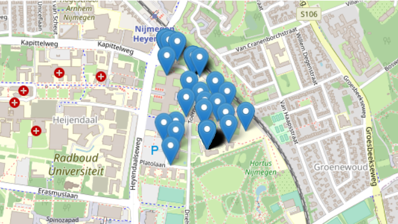
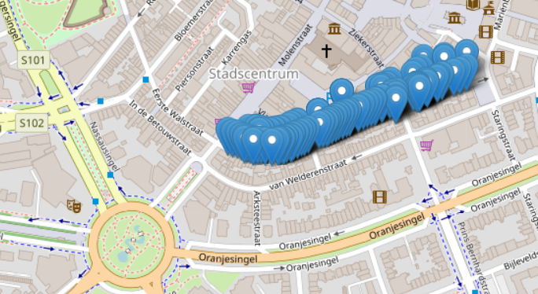
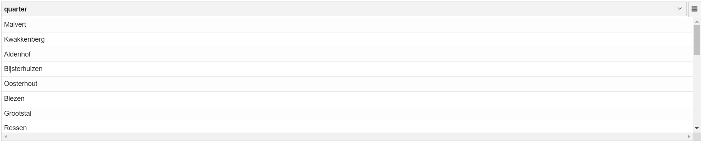
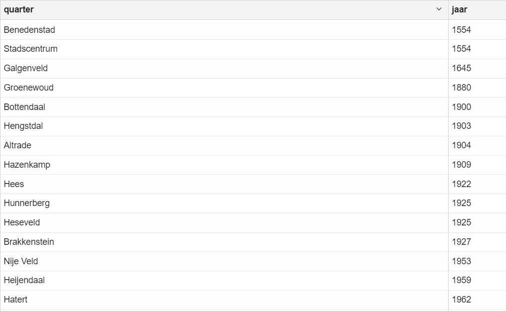

# Assignment 4
---

# Table of contents:
  * [Introduction](#introduction)
  * [Part A](#part-a)
  * [Part B](#part-b)
  * [Conclusion](#conclusion)


### Introduction
---
I will start by saying that while I think it is very cool how the city of Nijmegen (and probably other cities in the Netherlands as well) provides all this data for free, I would have enjoyed a dataset written out in English more, but I might be in the minority here.

This week we were given two data sets to work with:
  + A dataset called BAG, which contains data regarding the houses and streets of Nijmegen;
  + A dataset abbreviated as "kos", which contains data about artworks located in Nijmegen with their exact coordinates, year of creation, url and more.

There is not much more to introduce, as the working medium is exactly the same as last week, so I will jump right into discussing each notebook separately.

### Part A
---
#### Dealing with null values

A very useful tool one can use to see the distribution of their data while working with Spark is the function ```.describe().show()```. This gives you a table much like this one (keep in mind that this is made on the BAG dataset):


Surely, one of the most noticeable characteristics of the table are the null values populating the "mean" and "stddev"(standard deviation) fields of all the attributes. When talking about "STRAAT" or "WIJK_OMS", those represent string attributes, words which do not have a mean or standard deviation. But in the case of "X_COORD" and "Y_COORD", they are numbers; this means that the null values is being caused by -everyone, say it with me now!- INCOMPLETE DATASETS, HOORAY!

All joking aside, when trying to check for null coordinate values, 
```s
addrDF.filter( $"X_COORD".isNull && $"Y_COORD".isNull).count
addrDF.filter( $"X_COORD".isNull || $"Y_COORD".isNull).count

Output: 
res62: Long = 45
```
We get that there are 45 records in this dataset that have null values instead of coordinates. I used ```addrDF.filter( $"X_COORD".isNull ).show(45,false)``` in order to see all of these problematic records. The next step to take is choosing how to deal with these records. In some cases, it is fine to just ignore them especially when, as in this case, they represent only a very small part of the dataset (45/~10000 in this case); some other times, one should put in more effort and try to infer correct values by looking at the records with real values, but this is highly dependent on how the data you are working with is built and whether it can be inferred.

#### Dealing with different data formats

Something important to note is that different countries use different ways of writing their numbers, and I'm talking specifically about whether you us the comma for floating point numbers or for numbers bigger than 1000 (as in, writing 1,000 or 1.000 for one thousand). In our case, the Netherlands uses a comma for the floats specifically, so a function to convert those was needed.
```s
import java.text.NumberFormat
import java.util.Locale
val nf = NumberFormat.getInstance(Locale.forLanguageTag("nl")); // Handle floats written as 0,05 instead of 0.05

def convToFloat(s: String): Option[Float] = {
  try {
    Some(nf.parse(s).floatValue)
  } catch {
    case e: Exception => None
  }
}
```
Now, all of our values were finally in order, as we have also replaced null values with 0 with ```convToFloat(x).getOrElse(0f)``` and finally got this table:


Now, I will be honest and say that I had no idea how to read the output of the ```.explain()``` operator. This is something that I need to try and understand a lot more.

For the final part of this first notebook, we explored ways of figuring out what is wrong with a dataset only by looking at the statistics.

### Part B
---
#### Learning to work with Helium
In this second part of the assignment, we were introduced to a new framework: Helium. One of its visualizations is zeppelin-leaflet, allowing us to create maps and mark various locations on these maps through Spark SQL queries.

We started off by by looking at the Toernooiveld coordinates found in the BAG dataset, resulting in the following map:



We got this result by using the following query:
```SQL
select street, quarter, latlon._1 as lat, latlon._2 as lon
from ( select street, quarter, txyudf(x,y) as latlon from addr where street = "Toernooiveld")
```

As I am an international student attending university courses through online means at the moment, I do not have a place to stay in the Netherlands at the moment, nor do I have much memory of any street names whatsoever. As such, I have mapped the street of my favorite store while I was staying in the Netherlands (I will keep the name of the store for myself though :)):



#### Joining the two datasets

Our main purpose of using this framework was to join the two datasets that we have explored previously. Thinking about it as it is, it might seem realtively simple as one can just associate the coordinates of the artworks with the coordinates of the streets found in the BAG dataset. This sadly will not work out of the box for one simple reason: the two datasets use different coordinate systems! BAG uses the Rijksdriehoekscoördinaten (if you are an international student as myself, I feel your pain) while the arts dataset uses the Geographic Coordinate System with longitude and latitude.

Now, it is probably rather clear to everyone what needs to be done, and that is converting one system to the other. Thankfully there are tools that make this a lot easier, and the author of the notebooks has also been nice enough to create the functions for us. This was done using code that is serializable in Spark. While I have had a rather hard time understanding all of the subtleties of such code, [this](https://medium.com/onzo-tech/serialization-challenges-with-spark-and-scala-a2287cd51c54) article might give you -the reader- a bit more insight than I am capable of.

This is the SQL query to create the view that we will be basing our results off of in the following sections of this blog:
```SQL
create temp view kosxy as
select naam, bouwjaar, latitude, longitude, XY._1 as x, XY._2 as y 
from ( select naam, bouwjaar, latitude, longitude, transformLatLon(latitude, longitude) as XY from kos )

create temp view kosquarter as
select distinct naam, quarter, first(latitude), first(longitude), min(bouwjaar) as jaar from kosxy, addr
where abs(kosxy.x - addr.x) < 10.0 and abs(kosxy.y - addr.y) < 10.0
group by naam, quarter
```

#### Looking at art

After succesfully joining the two datasets, we can take a look at the initial research question:
  >Can we infer the growth of the city of Nijmegen through the years from the years in which the artworks were created?

In order to see which quarter had the earlies art piece, we use the following SQL query to group our data:
```SQL
select distinct quarter, min(jaar) as jaar from kosquarter group by quarter order by jaar
```

What one can quicly notice is that there are a lot of missing quarters from this list. The exact number can be seen using the following queries:
```SQL
select count(distinct quarter) from addr
select count(distinct quarter) from kosquarter
```

The first query returns 44 quarters and the second one only 17 distinct quarters. This brings us to 27 missing quarters in the koswuarter view. A more detailed look at which exact quarters are missing can be seen by using the query ```select distinct quarter from addr where quarter not in (select distinct quarter from kosquarter)```, which returns a list of 27 quarter names, as expected:



#### Fixing initial issues
Now, the next question we were tasked with answering was:
  >Can you produce a longer list of quarters and their oldest artworks?

Because of the various transformations that took place in order to join the two datasets, the kosquarter view classifies its artworks based on (x,y) coordinates. Furthermore, in order to have an art piece be classified as being part of a quarter, the absolute value difference between the coordinates of the art piece and the quarter has to be less than 10. That was a mouthful, but in short it means that the art piece needs to be in a radius of 10 from the center of the quarter in order to be registered as part of it. This is problematic because of multiple reasons:
  + A quarter is not circular, not even rectangular most of the times and thus a circular radius does not cover all of its corners
  + 10 is a rather small radius
  + If the radius is increased too much, quarter radiuses will start overlapping, giving inaccurate results

With this being said, nobody can say anything for sure without actually testing it. As such, I proceeded to increase the radius to 50 to see how many quarters it includes and if there is any overlapping yet.

```sql
create or replace temp view kosquarter2 as
  select distinct naam, quarter, first(latitude), first(longitude), min(bouwjaar) as jaar from kosxy, addr
  where abs(kosxy.x - addr.x) < 50.0 and abs(kosxy.y - addr.y) < 50.0
  group by naam, quarter

select distinct quarter, min(jaar) as jaar from kosquarter2 group by quarter order by jaar
```

The results were, well... predictable. As I predicted above, the bigger radius has succeeded in including a lot more art pieces. Now, there were only 23 missing artpieces compared to the previously 136 missing pieces. Also, there were only 13 missing quarters. Of course, this did come with the expected cost of overlapping appearing in more than one place. Here is part of the result so you can judge for yourself:



This gives us an answer to the question "Can we infer the growth of the city of Nijmegen through the years from the years in which the artworks were created?". Yes, we can indeed create a larger list. Its accuracy and correctness cannot be vouched for, for reasons previously stated.

Continuing to increase the radius will mostly muddy the results even further, so I will decide to stop here. There are limitations to this approach and I think I have reached them. 

### Conclusion
---
As last week, this was a rather pleasant experience and while I cannot say that I have an in-depth understanding of all that was discussed in the notebooks (such as the query explanation in part A), I believe I have understood most concepts to a level at which I can use them myself and succeed while doing so.

