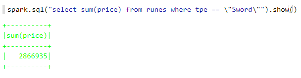

# Assignment 5
---

## Table of contents:
  * [Introduction](#introduction)
  * [Working through the material](#working-through-the-material)
  * [I'm DIY-ing this](#im-diy-ing-this)
  * [Conclusion](#conclusion)

### Introduction
---
In the previous episodes, we have seen how we can manipulate static data using Spark and Scala, and different ways to visualize such data with the help of SQL queries. This week in **"Why am I doing this to myself"**, we will witness what happens when a mid-existential crisis university student has to deal with constant streams of data while keeping it together with the help of copious amounts of energy drink infused coffee.

Now, to be more specific, we will be using Spark Structured Streaming. This is a rather interesting subject, as nowadays a lot of analysis that people do is on a continuous stream of data, such as a gardener checking humidity and nutrients levels or e-commerce traders that are checking their Dogecoin value every 5 minutes to see if Elon Musk's appearance on SNL raised the price.

### Working through the material
---
Now, the experience was rather streamlined, as it consisted mostly of pressing the run button without having to think much about it beforehand. We read data from a stream of RuneScape purchases, containing the type of the item, the material, and the price that was paid for it. This stream could then be stored in memory, we could perform SQL queries on it aaand... that's about it. And you didn't believe me when I said streamlined...

The most mentally intense part of this week's material consisted of changing this regular expression: `\"^([A-Z].+) [A-Z].+ was sold for (\\\\d+)\"` to this one: `\"^([A-Z].+) ([A-Z].+) was sold for (\\\\d+)\"`; now, for the less perspicacious few of the bunch I will state that the only changes made there were adding an open and a closing paranthesis. 

Now, this section was cut short by the fact that I got an error when trying to create a `writeStream()`. I could not find an answer to this that satisfied both making this work and me having to do as little as possible, so I gave up. But do not worry, I will give a short explanation of what the rest of the notebook contained, to the level that my monkey brain could comprehend it.

While storing the streaming information in memory is just fine, most of the time memory sizes are dwarfed by the capacity of non-volatile memory(hard drives, SSDs, you know them). As such, it is very advantageous to store some data and analyze it later. And that is exactly what we did, and succeeding that, more SQL queries on the stored data.

### I'm DIY-ing this
---
Now, since I could not get to the second part of the material this week, I decided to skip right to the DIY part and take it upon myself to do it.

I will not go on about my code since you can see it practically in the rest of the assignment; I will be honest and say that it is mostly a moderated copy-paste from the already written code in the assignment, but what are we supposed to do since the task that we were given is exactly the same besides a different SQL query??

I did go ahead and answer the questions that we were addressed, and here are my results:

Q: How many rune items were sold?
A:8440

Q: How many of each item type was sold?
A: About equal for all items

Q: How much gold was spent buying swords?
A:2866935

Now for the curious kind out there asking themselves "Why did he not use a simple query like before, why use spark.sql().show() to do it?"; I do not know, and frankly, after everything that did not work in this notebook, I do not care anymore.

### Conclusion
---
Without joking, it was interesting, easy, and very manageable. Nice assignment!